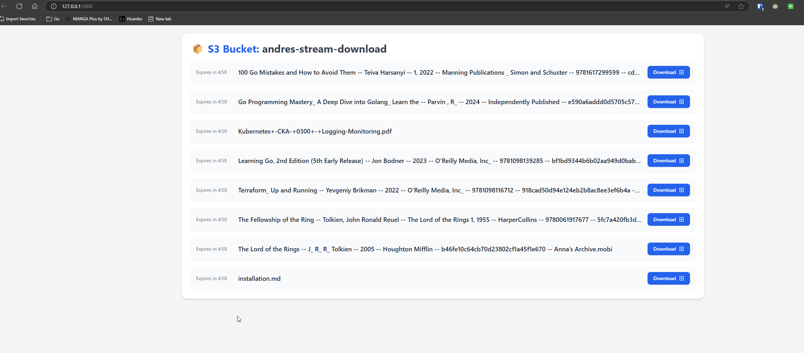

# Flask Presigned URL Expiration App with Docker

This project demonstrates a simple Flask web application that handles presigned URLs, countdown timers,This README focuses on building and running the application using Docker.

## Prerequisites

- **Docker**: Ensure Docker is installed on your machine. You can follow the installation instructions here: https://docs.docker.com/get-docker/

## Docker Setup

### 1. Clone the repository

First, clone the repository if you haven't already:

```bash
git clone git@github.com:asoltes/file-download-stream-app.git
cd file-download-stream-app
```

```bash
docker build -t file-download-stream:v1.0.0 .
docker run -p 5000:5000 -v ~/.aws:/root/.aws file-download-stream:v1.0.0
```

Now access on  http://127.0.0.1:5000/


